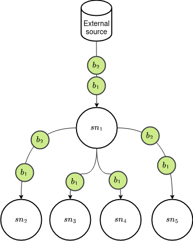
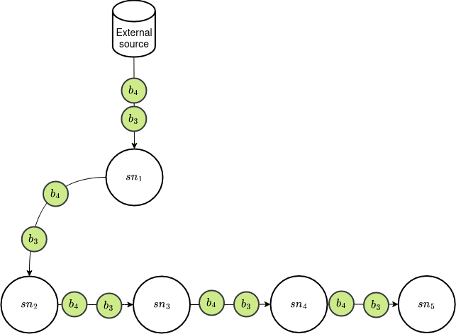

<div id="top"></div>
<!-- PROJECT LOGO -->
<br />
<div align="center">
  <a href="#">
    
  </a>

  <h3 align="center">Storage node - V10.0.0</h3>

  <p align="center">  A storage node which perform basic operations (e.g writing and reading data). This nodes are able to spawn more storage nodes and distribute the balance among their children. 
    <br />
    <a href="#"><strong>Explore the docs »</strong></a>
    <br />
</div>


<!-- TABLE OF CONTENTS -->
<details>
  <summary>Table of Contents</summary>
  <ol>
    <li>
      <a href="#getting-started">Getting Started</a>
      <ul>
        <li><a href="#prerequisites">Prerequisites</a></li>
        <li><a href="#installation">Installation</a></li>
      </ul>
    </li>
    <li><a href="#usage">Usage</a></li>
    <li><a href="#contributing">Contributing</a></li>
    <li><a href="#license">License</a></li>
    <li><a href="#contact">Contact</a></li>
    <li><a href="#acknowledgments">Acknowledgments</a></li>
  </ol>
</details>


<!-- ABOUT THE PROJECT -->
## Software Architecture
<div align="center">
  <a href="#">
    
  </a>
</div>
<p align="center">(<a href="#top">back to top</a>)</p>

<!-- GETTING STARTED -->
## Getting Started
### Prerequisites
This is the list of libraries you need to use the software and how to install them.
* Docker: https://docs.docker.com/engine/install/ubuntu/
* Docker compose: https://docs.docker.com/compose/install/ 
* Pulling docker images
  ```sh
  docker pull nachocode/storage-node:v10
  ```
### Deploy
The system is deployed using docker compose

1. Clone the repo
   ```sh
   git clone https://github.com/nachocodexx/storage-node
   ```
2. Run all services
   ```sh
   docker compose up -d
   ```

<p align="right">(<a href="#top">back to top</a>)</p>


<!-- USAGE EXAMPLES -->
## Usage
The first example is create a system that follows the next diagram:
<div align="center">
    <a href="#">
        
    </a>
</div>
The code that represents the shown diagram is as follows:

```yaml
[
  {
      "who":"",
      "what":[
          {
            "ballId": "b1",
            "url":"http://www.africau.edu/images/default/sample.pdf",
            "metadata":{"extension":"pdf"}
          },
        {
          "ballId": "b2",
          "url":"http://www.africau.edu/images/default/sample.pdf",
          "metadata":{"extension":"pdf"}
        }      
      ],
      "where":[
          {
              "id":"sn0_sn1",
              "metadata":{}
          },
          {
              "id":"sn0_sn2",
              "metadata":{}
          },
          {
              "id":"sn0_sn3",
              "metadata":{}
          },
          {
              "id":"sn0_sn4",
              "metadata":{}
          }
      ],
      "how":{
          "replicationTechnique":"ACTIVE",
          "transferType":"PUSH",
          "deferred": true
      },
      "when":{
          "timing":"REACTIVE",
          "metadata":{"test":"1"}
      },
      "elastic":true
  }

]
```

The result of the replication process is shown below, assuming that /test/sink is the path that was used to place the volumes:
```bash
/test/sink
├── sn0
│   ├── b1
│   └── b2
├── sn0_sn1
│   ├── b1
│   └── b2
├── sn0_sn2
│   ├── b1
│   └── b2
├── sn0_sn3
│   ├── b1
│   └── b2
└── sn0_sn4
    ├── b1
    └── b2
```

The second example is create a system that follows the next diagram:
<div align="center">
    <a href="#">
        
    </a>
</div>
The code that represents the shown diagram is as follows:

```yaml
[
  {
      "who":"",
      "what":[
          {
            "ballId": "b3",
            "url":"http://www.africau.edu/images/default/sample.pdf",
            "metadata":{"extension":"pdf"}
          },
          {
            "ballId": "b4",
            "url":"http://www.africau.edu/images/default/sample.pdf",
            "metadata":{"extension":"pdf"}
          }
      ],
      "where":[
          {
              "id":"sn0_sn1",
              "metadata":{}
          }
      ],
      "how":{
          "replicationTechnique":"PASSIVE",
          "transferType":"PUSH",
          "deferred": true
      },
      "when":{
          "timing":"REACTIVE",
          "metadata":{"test":"1"}
      },
      "elastic":true
  },
    {
      "who":"sn0_sn1",
      "what":[
          {
            "ballId": "b3",
            "url":"http://www.africau.edu/images/default/sample.pdf",
            "metadata":{"extension":"pdf"}
          },
          {
            "ballId": "b4",
            "url":"http://www.africau.edu/images/default/sample.pdf",
            "metadata":{"extension":"pdf"}
          }
      ],
      "where":[
          {
              "id":"sn0_sn2",
              "metadata":{}
          }
      ],
      "how":{
          "replicationTechnique":"PASSIVE",
          "transferType":"PUSH",
          "deferred": true
      },
      "when":{
          "timing":"REACTIVE",
          "metadata":{}
      },
      "elastic":true
  },
    {
      "who":"sn0_sn2",
      "what":[
          {
            "ballId": "b3",
            "url":"http://www.africau.edu/images/default/sample.pdf",
            "metadata":{"extension":"pdf"}
          },
          {
            "ballId": "b4",
            "url":"http://www.africau.edu/images/default/sample.pdf",
            "metadata":{"extension":"pdf"}
          }
      ],
      "where":[
          {
              "id":"sn0_sn3",
              "metadata":{}
          }
      ],
      "how":{
          "replicationTechnique":"PASSIVE",
          "transferType":"PUSH",
          "deferred": true
      },
      "when":{
          "timing":"REACTIVE",
          "metadata":{}
      },
      "elastic":true
  },
    {
      "who":"sn0_sn3",
      "what":[
          {
            "ballId": "b3",
            "url":"http://www.africau.edu/images/default/sample.pdf",
            "metadata":{"extension":"pdf"}
          },
          {
            "ballId": "b4",
            "url":"http://www.africau.edu/images/default/sample.pdf",
            "metadata":{"extension":"pdf"}
          }
      ],
      "where":[
          {
              "id":"sn0_sn4",
              "metadata":{}
          }
      ],
      "how":{
          "replicationTechnique":"PASSIVE",
          "transferType":"PUSH",
          "deferred": true
      },
      "when":{
          "timing":"REACTIVE",
          "metadata":{}
      },
      "elastic":true
  }
]
```

The result of the replication process is shown below, assuming that /test/sink is the path that was used to place the volumes:
```bash
/test/sink
├── sn0
│   ├── b3
│   └── b4
├── sn0_sn1
│   ├── b3
│   └── b4
├── sn0_sn2
│   ├── b3
│   └── b4
├── sn0_sn3
│   ├── b3
│   └── b4
└── sn0_sn4
    ├── b3
    └── b4
```
<p align="right">(<a href="#top">back to top</a>)</p>

<!-- CONTRIBUTING -->
## Contributing

Contributions are what make the open source community such an amazing place to learn, inspire, and create. Any contributions you make are **greatly appreciated**.

If you have a suggestion that would make this better, please fork the repo and create a pull request. You can also simply open an issue with the tag "enhancement".
Don't forget to give the project a star! Thanks again!

1. Fork the Project
2. Create your Feature Branch (`git checkout -b feature/AmazingFeature`)
3. Commit your Changes (`git commit -m 'Add some AmazingFeature'`)
4. Push to the Branch (`git push origin feature/AmazingFeature`)
5. Open a Pull Request

<p align="right">(<a href="#top">back to top</a>)</p>


<!-- LICENSE -->
## License

Distributed under the MIT License. See `LICENSE.txt` for more information.

<p align="right">(<a href="#top">back to top</a>)</p>


<!-- CONTACT -->
## Contact

Nacho Castillo - [@nachocodexx](https://nachocodexx.github.io/) -jesus.castillo.b@cinvestav.mx

<p align="right">(<a href="#top">back to top</a>)</p>


<!-- ACKNOWLEDGMENTS -->
## Acknowledgments

Use this space to list resources you find helpful and would like to give credit to. I've included a few of my favorites to kick things off!

* [Scala](https://www.scala-lang.org/)
* [Docker](https://www.docker.com/)

<p align="right">(<a href="#top">back to top</a>)</p>
